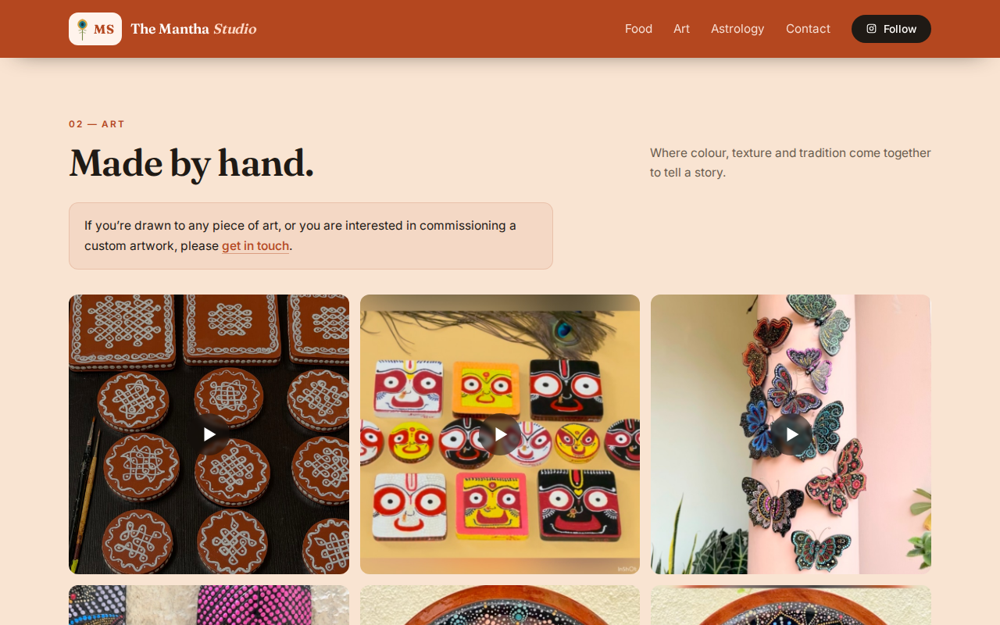
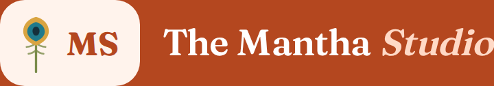

# Answers to your questions — 1 October 2026

Freelancer's attachments won't open for you, so everything lives here from now
on. You can read this in GitHub, and I can update it without sending you a file.

Live site: https://anirudhatalmale6-alt.github.io/manthas-food-palette/
(hard refresh before looking — Ctrl+Shift+R, or Cmd+Shift+R on a Mac)

---

## 1. The hero picture

You were right that it isn't the latest post, and here's why: I told it to pick
her most recent **photograph**. Almost everything she posts now is a reel, so
the newest actual photo is older than the newest post. That was my decision,
not a fault — but it surprised you, which is just as bad.

Pick one and I'll set it:

| Option | What you get |
|---|---|
| Newest photograph | What it does today. Skips reels entirely. |
| Newest post of any kind | Always current, but usually a reel — so you'd get the reel's cover frame as a still, and you don't get to vet what lands there. |
| **A pinned post** | One picture you've chosen, there until you change it. My recommendation. |

**Can it be the video itself?** Technically yes, for about half of them. I'd
advise against it: Instagram won't give me the video file for 121 of her 220
reels, so a video hero would play for some posts and silently fall back to a
still for others. It's also a heavy download on a phone.

**Is it hard to manage yourselves later?** No. It's one line in one file,
edited in the browser. See the maintenance guide.

---

## 2. The two blurbs

Both now use your words exactly:

- **Food** — "Where every meal tells a story, and every spice brings India to the table."
- **Art** — "Where colour, texture and tradition come together to tell a story."

One note, take it or leave it: both lines end on *tells a story*. Side by side
the repetition is noticeable. You could change the Art one to something like
"…come together in every piece." Entirely your call — it's Suvarna's brand,
not mine.

---

## 3. The commissions line

Added directly under **Made by hand.**, in a soft box so it reads as an
invitation rather than small print. "Get in touch" is a working link down to
the contact section — I clicked it on the live site to be sure it lands in the
right place.

---

## 4. The peacock feather

It's drawn in code rather than being an image file, so it stays sharp on any
screen and adds nothing to the page weight. I gave it the real peacock colours
— gold, teal, dark centre, green stem — because a single-colour feather at that
size just reads as a dot on a stick. I tried it. It didn't work.

If you or Suvarna would rather have a particular feather, send me any image and
I'll use it instead. Mine is there and working, so only replace it if you
actively prefer another.

---

## 5. The domain, and paying by PayPal

Yes, PayPal is fine, and an Australian account is no problem.

1. Go to namecheap.com and search for **themanthastudio.com**. It was still
   free when I last checked.
2. Buy it **in your own name**, paying with PayPal. Expect roughly AUD 20–25
   for the year.
3. **Decline every extra** — hosting, email, SSL, "premium DNS". You need none
   of it. Do keep WhoisGuard / domain privacy if it's free, which it usually is.
4. Since this is a gift and meant to last, consider registering for two or
   three years at once. Cheaper per year, and no risk of it lapsing.
5. Then send me a screenshot of the DNS settings page and I'll give you the
   four records to add. The site will be live on the real address within the
   hour, with HTTPS, at no further cost.

Namecheap is just the shop — any registrar works. Ask me before you pay if
anything on the page looks like an upsell.

---

## 6. Looking after it yourself

The guide is here:
https://github.com/anirudhatalmale6-alt/manthas-food-palette/blob/main/MAINTENANCE.md

It covers changing any text, changing the phone or email, choosing the hero
picture, moving a post between Food and Art, forcing the feed to update, and
the two things that can genuinely go wrong — neither of which takes the site
down.

Everything is done in a browser on github.com. No server, no database, no build
step.

**Since this is a gift:** the repository currently sits under my GitHub account.
When you're happy with everything I can transfer it to an account of yours or
Suvarna's, so you own the lot outright and aren't dependent on me being around.
Say the word.

---

## 7. Something that proved itself

The automatic sync ran on its own schedule, with no involvement from me, fetched
her 288 posts, re-sorted them and updated the site. That's the part that means
neither of you ever has to touch this thing for it to stay current.

---

## What I still need from you

1. **Which hero option** — my vote is pinning the acrylic Hanuman.
2. **Keep my feather, or send me one you prefer.**
3. **Which email address the two forms should deliver to.** They're still wired
   to nothing, and that's the last real gap in the site.
