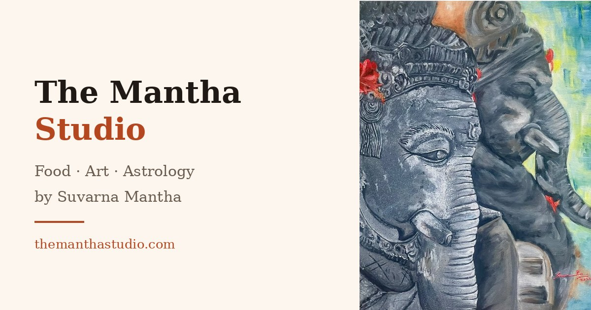

# Getting found — where the site stands

Short version: the technical groundwork is done and I've just put it live. The
rest is time and habit, and most of it is Suvarna's to do rather than mine.

## What I've just added

| | Why it matters |
|---|---|
| Link preview card | Paste themanthastudio.com into WhatsApp or Instagram DM and it now shows a proper card with the Ganesha painting and her name, instead of a bare blue link. This is the single biggest practical win, because almost all her traffic will come from people sharing the link. |
| Structured data | Tells Google in its own language who Suvarna is, what she does, her Instagram, her phone and email. Helps her own name become a search result rather than a guess. |
| Canonical address | Stops Google treating the www and non-www versions as two competing sites. |
| sitemap.xml and robots.txt | The formal "here is my site, please index it" that search engines look for. |
| Favicon | Her feather in the browser tab. |

## What will actually move the needle

**1. Register the site with Google.** Go to search.google.com/search-console,
add themanthastudio.com, and submit `https://themanthastudio.com/sitemap.xml`.
It's free and takes five minutes. It needs your Google login, so it has to be
you, not me — I'll talk you through any screen that looks odd. Without this you
wait for Google to stumble across the site; with it, you've told it directly.

**2. Put the link in her Instagram bio.** Right now the site has essentially no
inbound links, and links are most of how search engines judge a site. Her
Instagram profile is the most valuable link she owns, and it costs nothing.

**3. Be patient, and expect the right kind of win.** A brand new domain does
not rank for "Indian recipes" — that's competing with food empires that have
been publishing for fifteen years. What it will realistically win is her own
name and brand: *Suvarna Mantha*, *The Mantha Studio*, *Mantha dot work art*.
Someone who meets her, sees a piece of her work, or hears the name will find
her. That is the honest goal, and it's worth having.

## If you want to go further later

The site is one page. Search engines reward pages that answer a specific
question, so the natural next step — if Suvarna wants it — is giving individual
recipes their own pages, each with its ingredients and method as real text.
That is what would eventually bring strangers in from searches like "ragi
spinach balls recipe". It's a bigger piece of work and only worth doing if she
wants to write for an audience beyond Instagram. Say the word and I'll scope it.

## One honest limitation

The galleries are filled in by the browser after the page loads, so the photo
captions aren't in the page's source text. Google does run the code and will
see them, but some smaller search engines won't. It doesn't affect the parts
that matter — her name, the three sections, the contact details and the
commissions line are all plain text in the page itself.
